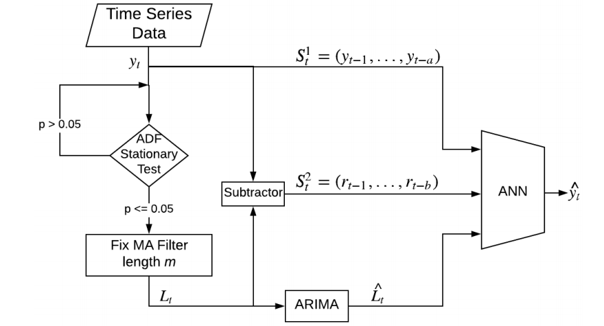
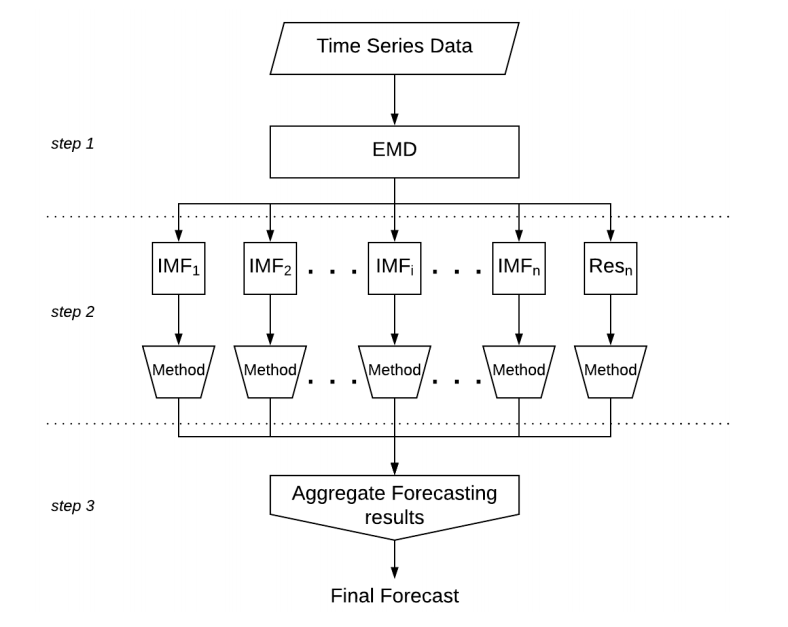
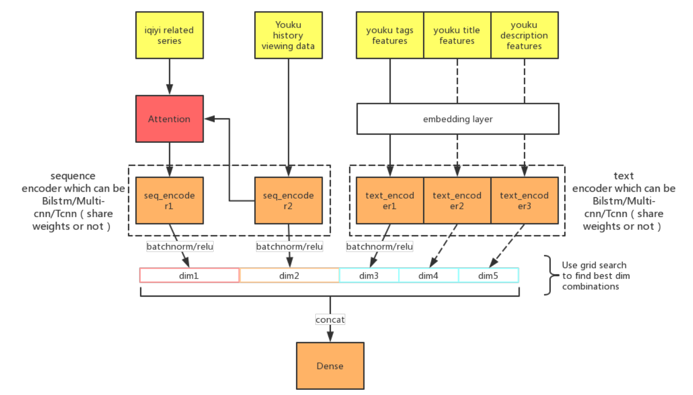
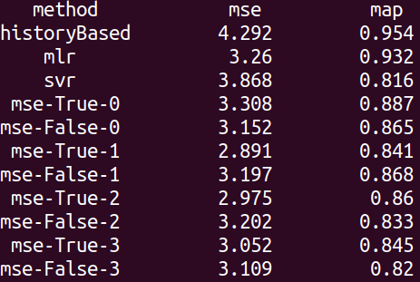

<!-- TOC -->

- [传统时序建模方法](#传统时序建模方法)
    - [1.AR](#1ar)
    - [2.MA](#2ma)
    - [3.ARMA](#3arma)
- [深度学习方法](#深度学习方法)
    - [1.TCNN](#1tcnn)
    - [2.RNN](#2rnn)
- [注意事项](#注意事项)
    - [1.概念漂移](#1概念漂移)
    - [2.序列的自相关性](#2序列的自相关性)
    - [3.训练集和测试集的划分](#3训练集和测试集的划分)
    - [4.序列分解](#4序列分解)
- [具体实践-流行度预测](#具体实践-流行度预测)
    - [1.数据描述](#1数据描述)
    - [2.时序数据特点](#2时序数据特点)
    - [3.时序数据分解方式](#3时序数据分解方式)
    - [4.外部特征](#4外部特征)
    - [5.模型初步结构](#5模型初步结构)
    - [6.现阶段结果](#6现阶段结果)
    - [7.问题](#7问题)
    - [8.进阶](#8进阶)

<!-- /TOC -->

## 传统时序建模方法

### 1.AR

### 2.MA

### 3.ARMA

## 深度学习方法

### 1.TCNN

### 2.RNN

## 注意事项

### 1.概念漂移

> 所谓概念漂移，表示目标变量的统计特性随着时间的推移以不可预见的方式变化的现象，也就是每过一段时间序列的规律是会变化的。所以，在这种情况下，拿全部时间内的数据去训练，就相当于是增加了各种噪声，预测精度是会下降的。所以，一种解决办法是不断的取最新的一阶段内的数据来训练模型做预测。

### 2.序列的自相关性

> 做过时间序列的朋友可能常常会有这样的感受，用了某种算法做出来的测试集的平均绝对误差率或者r2系数都很好，但是把测试集的真实值及预测值画出来对比一下，就会发现t时刻的预测值往往是t-1时刻的真实值，也就是模型倾向于把上一时刻的真实值作为下一时刻的预测值，导致两条曲线存在滞后性，也就是真实值曲线滞后于预测值曲线，就像下图右边所显示的那样。之所以会这样，是因为序列存在自相关性，如一阶自相关指的是当前时刻的值与其自身前一时刻值之间的相关性。因此，如果一个序列存在一阶自相关，模型学到的就是一阶相关性。而消除自相关性的办法就是进行差分运算，也就是我们可以将当前时刻与前一时刻的差值作为我们的回归目标

### 3.训练集和测试集的划分

> 在时间序列任务上，如果还跟其他任务一样随机划分训练集和测试集是不合理的。随机划分的测试集，跟训练集的分布会是很接近的，效果肯定比一刀切的方法更好。因此，一般是选取某个时间节点之前作为训练集，节点之后作为测试集

### 4.序列分解

> 对于无明显周期和非平稳时序数据，直接预测难以达到满意效果，可以利用经验模式分解(empirical mode decomposition,EMD)和长短期记忆(long short-term memory, LSTM)的组合算法应用于时序预测。将时序数据通过EMD算法进行分解,然后将分解后的分量数据分别转化为三维数据样本。对归一化的分量数据和原始数据分别进行预测建模及重构。

## 具体实践-流行度预测

### 1.数据描述
> 用户观看视频的数据。数据格式为：（时间，用户，视频）

### 2.时序数据特点
- 稀疏，很多为0
    1. 插值
    2. embedding（因为观看次数取值全为整数）
- 非平稳
    1. 时间序列分解
解决方案：**分解-->预测-->重组**

### 3.时序数据分解方式

- LN分解
> 分解成线性项和非线性项。可以理解成ensemble实现。

- EMD分解
> 分解成IMF分量。

- 小波分解

### 4.外部特征
- 视频的文本描述
- 相关外站视频同时间范围的观看序列，依然存在上述时序数据的问题
- 时间位置特征：星期几/当天的第几个周期/距离第一次被看的时间

### 5.模型初步结构

|特征|模型结构|
|----|----|
|主时间序列特征|LSTM-->dropout-->batchnorm|
|外部相关时间序列特征|Attention-->LSTM-->dropout-->batchnorm|
|外部文本特征|Dense-->activation-->dropout-->batchnorm|
|外部时间位置特征|未使用|

base模型的结构图：

### 6.现阶段结果

- 2019-5-17

> 调参的主要心得：
- 初始学习率很重要。现在使用的学习率为1e-2，当val_loss5次没有提升则将学习率变为十分之一。
- 激活函数也有影响。lstm最好使用tanh，dense的激活函数可以从relu换为selu/prelu。

> 提升思路：
- wide-deep模型，加入低阶特征, 混合模型是当前主要的提升手段
- embedding+lstm模型，在lstm前加入embedding层
- attention比较,多个attention拼接
- encoder替换:LSTM-->TCNN,Dense-->Transformer

### 7.问题

- 直接的LSTM模型效果比不上线性模型，需要细调模型结构
- 稀疏的数据是否需要数据归一化

### 8.进阶

对于冷启动视频的预测问题：即主时间序列特征全为0的情况（todo）